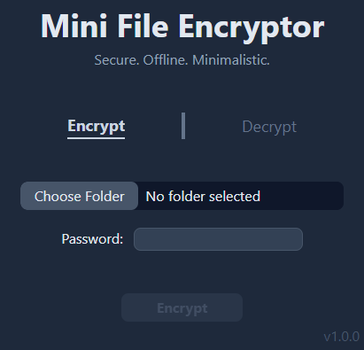
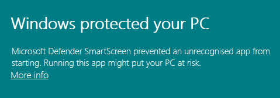
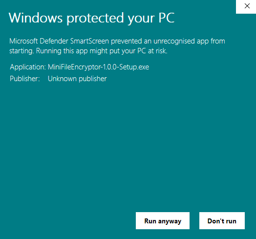
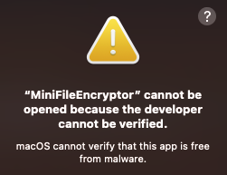
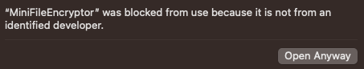

# Mini File Encryptor

Mini File Encryptor. A secure, offline, minimalistic file encryptor.



Encrypt any folder into a password-protected file.

Securely encrypted with AES256, being fully offline reduces the risk of leaking sensitive data to the Internet.

Having a minimalistic design, Mini File Encryptor is easy to use with no configuration or advanced settings needed.

## Download Links

[Download for Windows](https://github.com/gjtiquia/mini-file-encryptor/releases/download/v1.0.2/MiniFileEncryptor-1.0.2-Setup.exe)

Windows Download Instructions

1. Run the `.exe` file to install the app.

[Download for MacOS](https://github.com/gjtiquia/mini-file-encryptor/releases/download/v1.0.2/MiniFileEncryptor-darwin-x64-1.0.2.zip)

MacOS Download Instructions

1. Unzip the `.zip` file.
2. Drag the `.app` file into the `/Applications` folder.

## Troubleshooting - Windows



If the following warning is shown,

> Windows protected your PC

Click __More info__, then click __Run anyway__ at the bottom.



## Troubleshooting - MacOS



If the following warning is shown,

> "MiniFileEncryptor" cannot be opened because the developer cannot be verified.

Go to __System Settings > Privacy & Security__, scroll to the bottom and click __Open Anyway__.



## Commands

Run the following command to install all dependencies.

```bash
npm install
```

Run the following command to launch the app in dev mode.

```bash
npm run start
```
